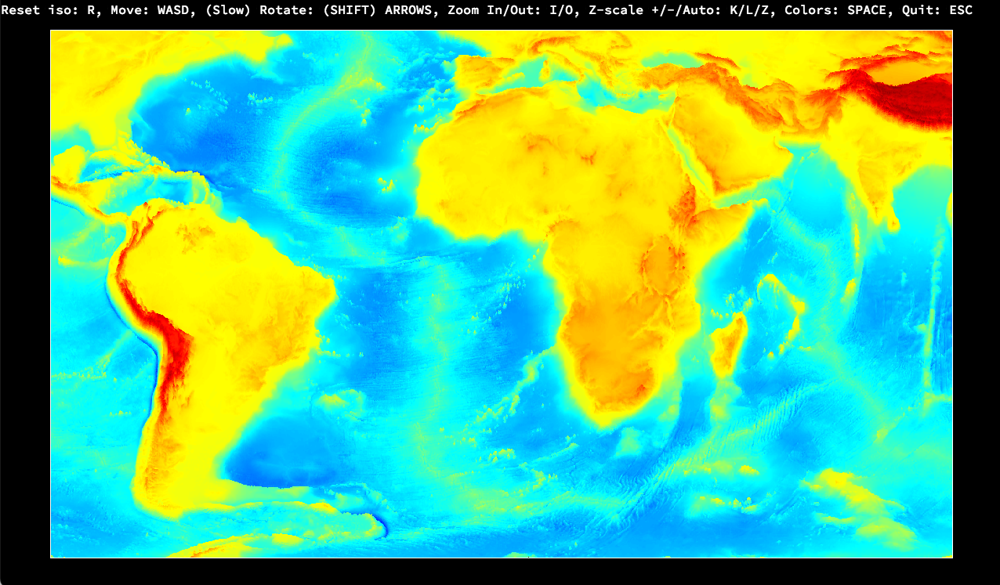

## Fil de Fer
This school 42 project objective is to create a visualizer for a Digital Elevation Model (DEM). The project is written in C, from scratch. It uses the minimal display library minilibX, that allows to create a window and display an image buffer into it. The input DEM consists of a square grid (x, y) of data elevation values (z). At startup, the visualizer displays the data in isometric view. The user can then:
* rotate the data
* shift the data
* increase or decrease the z-scale
* change the colorscale (z-dependent)

